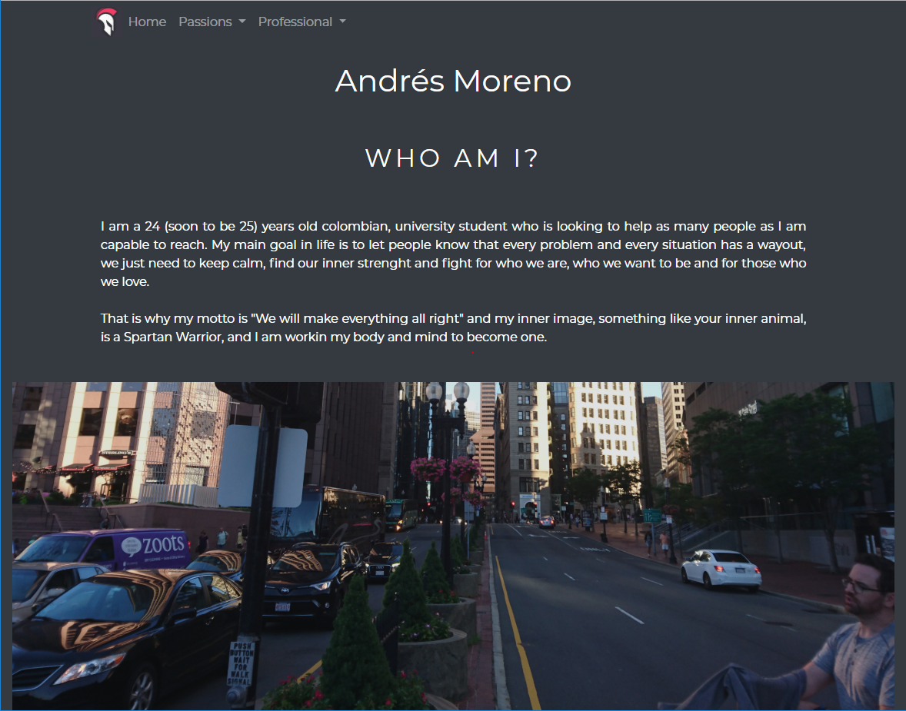

<h1> Andrés Felipe Moreno Marín Personal Web Page</h1>

This is my first web page ever developed. It was made with HTML5, CSS3, Javascript, Bootstrap and a little bit of JQuery. The main goal of it is to encourage the practice of new skills and web-dev-tools to improve it. The idea is to keep updating this web page as new learnings and technologies appear. 

<h2>Running</h2>

So far, this is a static web page with some javascript and bootstrap on it, so it can be runned on any server you want, like http-server.  This is the web link to see it in any web browser, does not matter if it is on a desktop or a mobile device: https://afmoreno10.github.io 

 

Made by Andrés Felipe Moreno Marín.   This project count with an MIT license, which can be consulted on the following link: https://github.com/afmoreno10/afmoreno10.github.io/blob/master/LICENSE 
